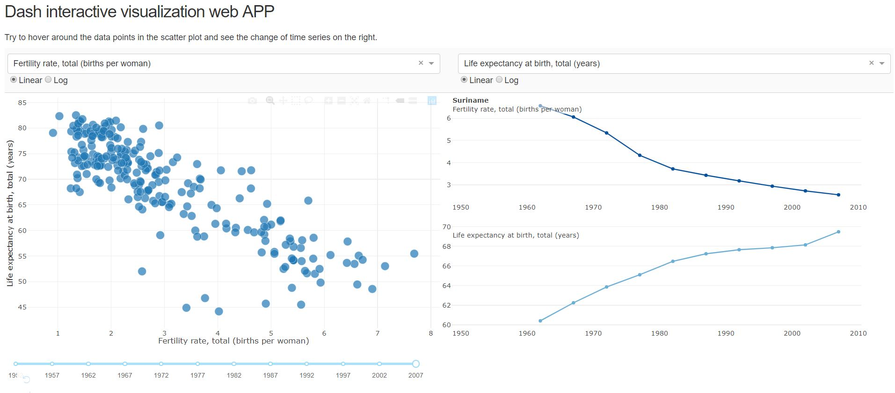

# Interactive data visualization
Aim to use python plotly, dash and functions in jupyter NBextensions to create smarter data visualizations and design dashboards that can be useful for business decision making or personal interests. 

## Dashboard with python dash and plotly
"Interactive dash charts.py" uses a world situation dataset with indicators in various aspects and creates interactive graphs with dropdowns, slider, radiobuttons and hover reaction on plots. Figure 1 shows the output.

